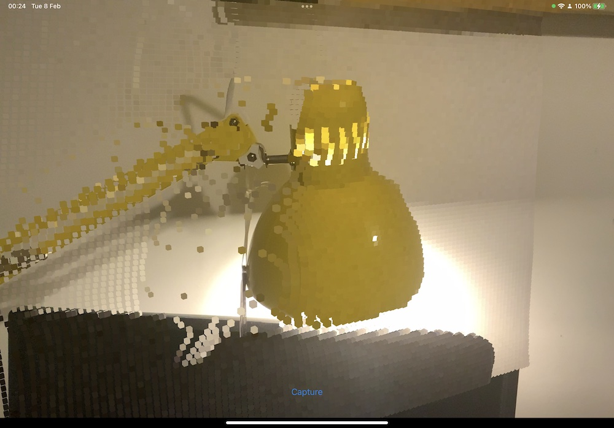
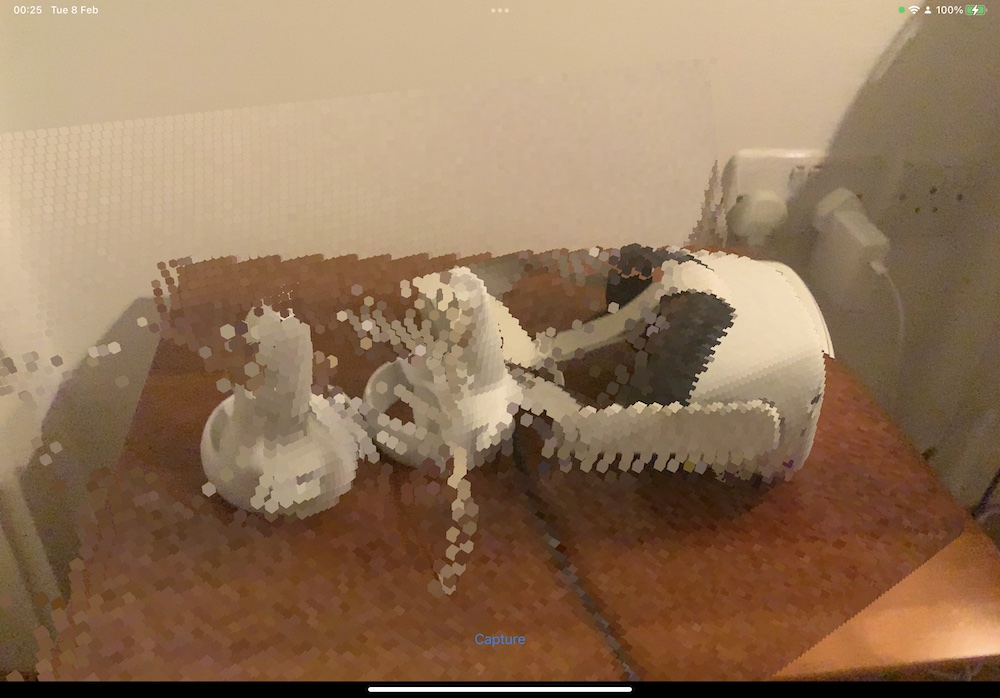
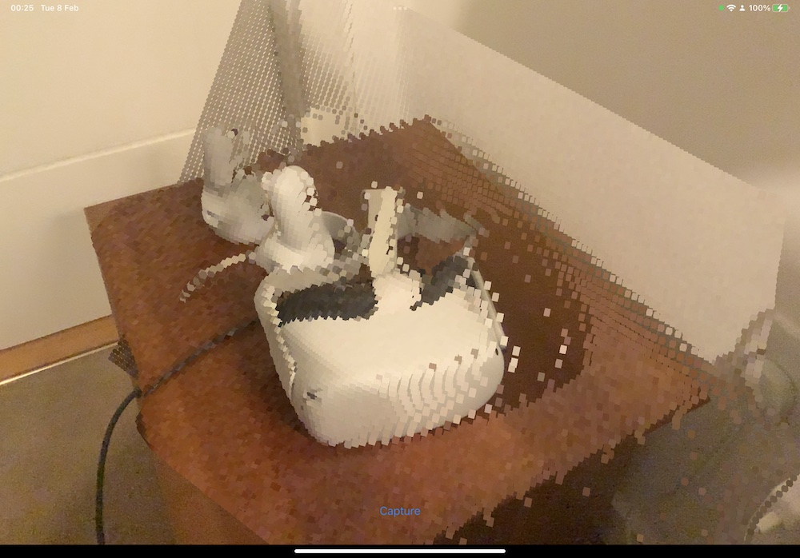

# iPad LiDAR Experiment

Simple experiment to capture and display Depth data from the iPad Pro's LiDAR sensor using ARKit.

This is based on [snowzurfer](https://gist.github.com/snowzurfer)'s [GitHub Gist](https://gist.github.com/snowzurfer/1e90678d0d23d3295dda9a0cc93b2453)

# Screenshots

# Requirements

Xcode 13.1 and iOS/iPadOS 15. 
